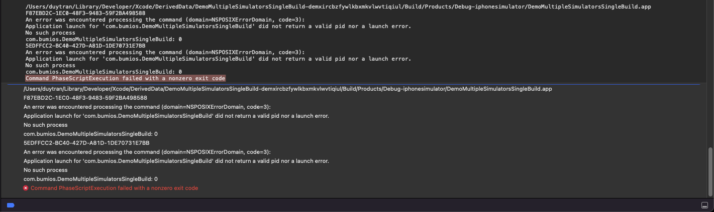
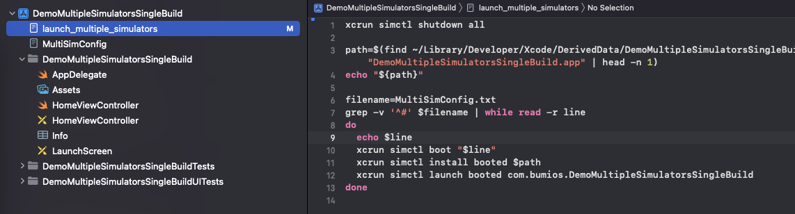

# DemoBuildMultipleSimulators
---

This repository is using for demo run multiple simulators on sigle build

I'm using Mac mini M1, macOS Monterey 12.3, Xcode 13.3.1 for demo this.

## Steps:

### 1/ Create pre-action build script

* Tap on current scheme and select at option **edit scheme**.
* At **Build** -> **Pre-actions** -> Create new **Run Script** and paste scripts below:

```shell
custom_sim=`xcrun simctl list | grep 'First Group Simulators' | awk -F'[()]' '{print $2}'`
if [ -z "${custom_sim}" ]; then
    xcrun simctl create First\ Group\ Simulators com.apple.CoreSimulator.SimDeviceType.iPhone-8 `xcrun simctl list runtimes | grep iOS | tail -1 | sed -e 's/^.*) - //p' | sort -u`
fi
```

**Describe:**

* At line 1 & line 3, **First Group Simulators** is the name of our custom simulators, it appear on list simulator as normally. At line 3, we need to added **\\** character before space to make it working.
* **...SimDeviceType.iPhone-8** is the default simulator when we run, and we will debug on this.


### 2/ Create `MultiSimConfig.txt` file at root directory of project, this file will contains all Identifier of our simulator we want to run for this custom build.

**For example:** 

```
F87EBD2C-1EC0-48F3-9483-59F2BA498588
5EDFFCC2-BC40-427D-A81D-1DE70731E7BB
```

We can get Identifier of simulators by 2 ways (as I known :P):

* Tap on device list area -> **Add Additional Simulators...** -> Select **Simulators** tab, then you can find identifier of device here.
* Or in terminal, run: `crun xctrace list devices`


### 3/ Create file `launch_multiple_simulators.sh`, put this file as same place with step 2

```shell
xcrun simctl shutdown all

path=$(find ~/Library/Developer/Xcode/DerivedData/DemoMultipleSimulatorsSingleBuild-*/Build/Products/Debug-iphonesimulator -name "DemoMultipleSimulatorsSingleBuild.app" | head -n 1)
echo "${path}"

filename=MultiSimConfig.txt
grep -v '^#' $filename | while read -r line
do
  echo $line
  xcrun simctl boot "$line"
  xcrun simctl install booted $path
  xcrun simctl launch booted com.bumios.DemoMultipleSimulatorsSingleBuild
done
```

Read description and replace: 

* Line 3: **DemoMultipleSimulatorsSingleBuild-*** is your workspace name.
* Line 4: **DemoMultipleSimulatorsSingleBuild.app** name of your app.
* Line 7: **MultiSimConfig.txt** name of file created at step 2.
* Almost last line: **com.bumios.DemoMultipleSimulatorsSingleBuild** is the bundle identifier of your project.


### 4/ Create project run script

Move to project **target** -> **Build Phases** -> Create **New Run Script Phases** -> Paste below script:

```shell
custom_sim=`xcrun simctl list | grep 'First Group Simulators' | awk -F'[()]' '{print $2}'`
if [ ! -z "${custom_sim}" ] && [ "${TARGET_DEVICE_IDENTIFIER}" = "${custom_sim}" ]; then
  /bin/sh launch_multiple_simulators.sh
fi
```

This script will load & run file on step 3.

## It's over, Good luck, mate !!


### Related issues:

1. **Build failed:**



**Step to resolved:**

* Open file `launch_multiple_simulators.sh`, at `filename=MultiSimConfig.txt`, remove `.txt` extension, then run project again.
  * The build will be successfully, but you can see, the simulator just run on only 1 default device. So let move to next step.
* Same with step 1, but we will added `.txt` extension back to file name, then run project on more time.
  * The issues is gone, all added simulators will be open after this step. Hope you will reach it!!




## ** References:

[KtrKathir post - Launch multiple simulator on a single compile in Xcode](https://ktrkathir.wordpress.com/2020/02/29/launch-multiple-simulator-on-a-single-compile-in-xcode/)
